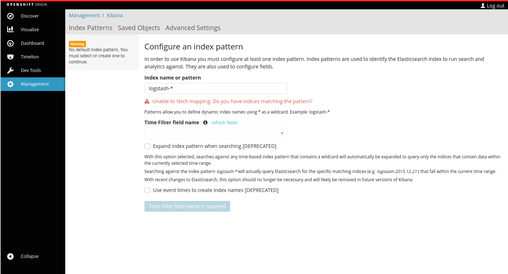

# origin-kibana
This repo provide a plugin to the Kibana Visualization tool to 
add OpenShift specific requirements.  The main features added
by this plugin are:

* Origin skinning
* Passing OpenShift Oauth token per request.

Currently compatible with the 4.1.x code stream of Kibana

### Hacking the code
* Run `bower install` to install patternfly locally
* Run `grunt` to build main.css
* You'll need a local fork of [kibana](https://github.com/elastic/kibana)
* Create a soft link pointing to the <root>/lib of this repo: `ln -fs . ../kibana/src/kibana/plugins/origin-kibana`
* Run kibana in dev mode via `grunt dev --with-es`, the UI should have an extra header above the regular kibana navigation bar.

### Current supported fragment parameters
When linking to kibana with the origin-kibana plugin you can control the container name and link back to the main console by setting the following parameters in the document hash:

* `console_container_name` - Used to set the container name text in the header
* `console_back_url` - Used as the URL in the back link to get back to the main console
* `console_auth_token` - Contains the authorization token for the user logged into the main console

Any parameter in the document hash prefixed with `console_` will be removed from the document hash once the UI is loaded.

To test it out you can access the kibana console with a URL like:

```
http://localhost:5601/#/dashboard#console_container_name=cookies&console_back_url=http:%2F%2Flocalhost:8443&console_auth_token=wheetoken
```

Which will modify the UI to:


